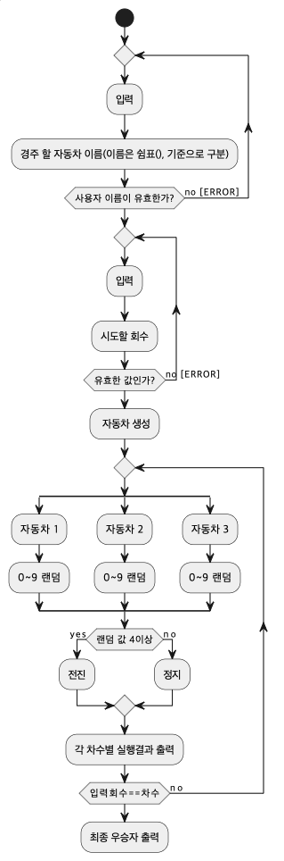

## 레이싱 게임

## 요구사항
•주어진 횟수 동안 n대의 자동차는 전진 또는 멈출 수 있다.
•각 자동차에 이름을 부여할 수 있다. 전진하는 자동차를 출력할 때 이을 같이 출력한다.
•자동차 이름은 쉼표 기준으로 구분하고 이름은 5자 이하만 가능.
•사용자는 몇번의 이동할 할 것인지를 입력할 수 있어야 한다.
•전진하는 조건은 0~9 사이에서 random 값을 구한 후 random 값이 4 이상일 경우 전진하고 3이하일 경우 멈춘다.
•자동자 경주를 완료한 후 누가 우승했는지를 알려준다.
•사용자가 잘못한 값을 입력한 경우 IllegalArgumentException를 발생 시키고 "[ERROR]"로 시작하는 에러 메시지를 출력하고 
그 부분부터 다시 입력을 받는다.
•Exception이 아닌 IllegalArgumentException, IllegalStateException 등과 같은 명확한 유형을 처리한다.

    

## 기능 목록
- 사용자가 입력한 이름을 쉼표 기준으로 분리
- 사용자의 입력 값의 이름들이 5자 이하인지 검증
- 0~9 랜덤 값 생성
- 자동차 입력 값이 4이상이면 전진, 3이하이면 멈춤 
- 자동차의 최대 위치 확인, 우숭자 목록 출력
